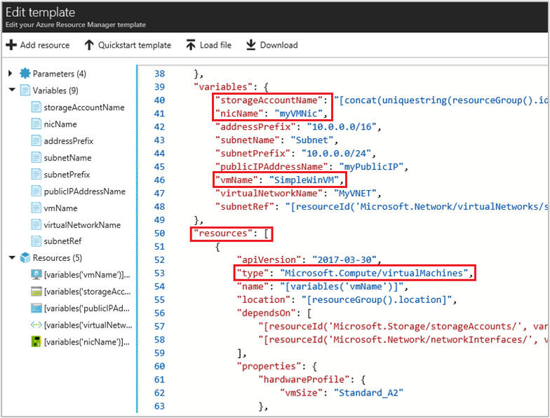

# Configure a user-assigned Managed Service Identity (MSI) for a VM, using an Azure template

[!INCLUDE[preview-notice](~/includes/active-directory-msi-preview-notice-ua.md)]

Managed Service Identity provides Azure services with a managed identity in Azure Active Directory. You can use this identity to authenticate to services that support Azure AD authentication, without needing credentials in your code. 

In this article, you learn how to enable and remove a user-assigned MSI for an Azure VM, using an Azure Resource Manager deployment template.

## Prerequisites

[!INCLUDE [msi-core-prereqs](~/includes/active-directory-msi-core-prereqs-ua.md)]

## Enable MSI during creation of an Azure VM, or on an existing VM

As with the Azure portal and scripting, Azure Resource Manager templates provide the ability to deploy new or modified resources defined by an Azure resource group. Several options are available for template editing and deployment, both local and portal-based, including:

   - Using a [custom template from the Azure Marketplace](~/articles/azure-resource-manager/resource-group-template-deploy-portal.md#deploy-resources-from-custom-template), which allows you to create a template from scratch, or base it on an existing common or [QuickStart template](https://azure.microsoft.com/documentation/templates/).
   - Deriving from an existing resource group, by exporting a template from either [the original deployment](~/articles/azure-resource-manager/resource-manager-export-template.md#view-template-from-deployment-history), or from the [current state of the deployment](~/articles/azure-resource-manager/resource-manager-export-template.md#export-the-template-from-resource-group).
   - Using a local [JSON editor (such as VS Code)](~/articles/azure-resource-manager/resource-manager-create-first-template.md), and then uploading and deploying by using PowerShell or CLI.
   - Using the Visual Studio [Azure Resource Group project](~/articles/azure-resource-manager/vs-azure-tools-resource-groups-deployment-projects-create-deploy.md) to both create and deploy a template.  

Regardless of the option you choose, template syntax is the same during initial deployment and redeployment. Creating and assigning a user-assigned MSI to a new or existing VM is done in the same manner. Also, by default, Azure Resource Manager does an [incremental update](~/articles/azure-resource-manager/resource-group-template-deploy.md#incremental-and-complete-deployments) to deployments:

1. Whether you sign in to Azure locally or via the Azure portal, use an account that is associated with the Azure subscription that contains the MSI and VM. Also ensure that your account belongs to a role that gives you write permissions on the subscription or resources (for example, the role of "owner").

2. After loading the template into an editor, locate the `Microsoft.Compute/virtualMachines` resource of interest within the `resources` section. Yours might look slightly different from the following screenshot, depending on the editor you're using and whether you are editing a template for a new deployment or existing one.

   >[!NOTE] 
   > This example assumes variables such as `vmName`, `storageAccountName`, and `nicName` have been defined in the template.
   >

    

3. Add the `"identity"` property at the same level as the `"type": "Microsoft.Compute/virtualMachines"` property. Use the following syntax:

   ```JSON
   "identity": { 
       "type": "systemAssigned"
   },
   ```

4. Then add the VM MSI extension as a `resources` element. Use the following syntax:

   >[!NOTE] 
   > The following example assumes a Windows VM extension (`ManagedIdentityExtensionForWindows`) is being deployed. You can also configure for Linux by using `ManagedIdentityExtensionForLinux` instead, for the `"name"` and `"type"` elements.
   >

   ```JSON
   { 
       "type": "Microsoft.Compute/virtualMachines/extensions",
       "name": "[concat(variables('vmName'),'/ManagedIdentityExtensionForWindows')]",
       "apiVersion": "2016-03-30",
       "location": "[resourceGroup().location]",
       "dependsOn": [
           "[concat('Microsoft.Compute/virtualMachines/', variables('vmName'))]"
       ],
       "properties": {
           "publisher": "Microsoft.ManagedIdentity",
           "type": "ManagedIdentityExtensionForWindows",
           "typeHandlerVersion": "1.0",
           "autoUpgradeMinorVersion": true,
           "settings": {
               "port": 50342
           },
           "protectedSettings": {}
       }
   }
   ```

5. When you're done, your template should look similar to the following:

    

## Remove MSI from an Azure VM

If you have a VM that no longer needs an MSI:

1. Whether you sign in to Azure locally or via the Azure portal, use an account that is associated with the Azure subscription that contains the VM. Also ensure that your account belongs to a role that gives you write permissions on the VM (for example, the role of “Virtual Machine Contributor”).

2. Remove the two elements that were added in the previous section: the VM's `"identity"` property and the `"Microsoft.Compute/virtualMachines/extensions"` resource.

## Related content

- For a broader perspective about MSI, read the [Managed Service Identity overview](msi-overview.md).

